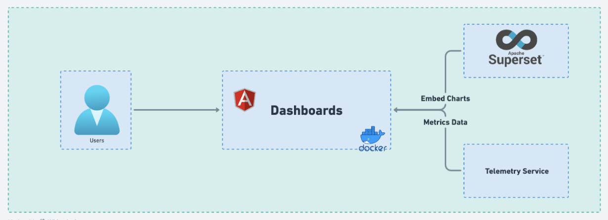
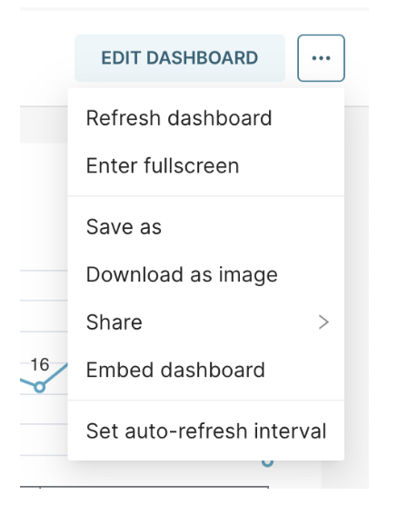
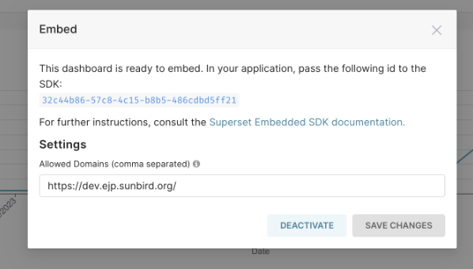
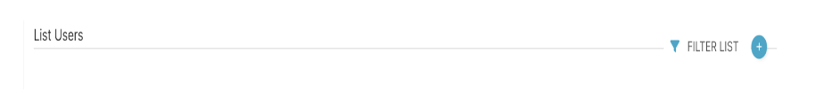
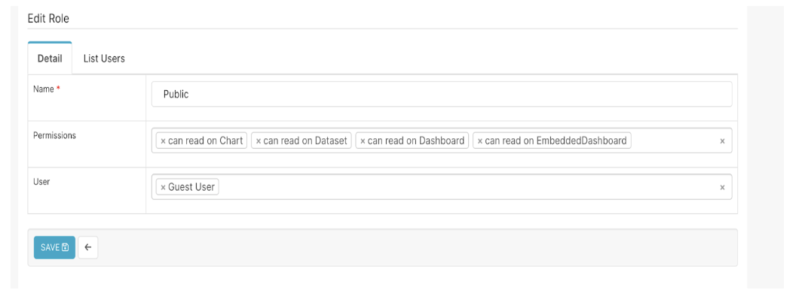

# Dashboard

The eJP Dashboard is a web application that consolidates and provides usage metrics of various eJP applications. This is enriched with Superset embedded charts, enhancing the depth of information and providing detailed analytics. Users can navigate through the dashboard to access a holistic view of key metrics, facilitating a better understanding of the performance and trends associated with the various services offered. 


High-level components
The eJP dashboard follows a microservice's architecture with the following key components: 



## Table of contents

- [Prerequisites](#prerequisites)
- [Project Setup](#project-setup)
- [Running Application](#running-application)
- [Testing](#testing)
- [Docker Deployment](#docker-deployment)
- [Dependencies List](#dependencies-list)
---

### Prerequisites

| Software dependencies |  |
| :--- | ------- |
| **[Node](https://nodejs.org/en/download/)** | > 16.x.x (Install the latest release of LTS version) |
| **[Angular CLI](https://angular.io/cli#installing-angular-cli)** | > 15.2.10 (Install the latest Angular CLI version) |
| **[yarn](https://classic.yarnpkg.com/en/)** | Latest version of yarn: `npm install --global yarn` |

### Project Setup

1. Clone project

    ```console
    git clone https://github.com/Sunbird-AIAssistant/portal.git
    ```

    > ***Note***: Stable versions of the dashboard portal are available via tags for each release, and the master branch contains latest stable release. For latest stable release [refer](https://github.com/Sunbird-AIAssistant/portal.git)

2. Install required dependencies

    ```console
    cd portal
    yarn install
    ```

3. The Dashboard requires the following environment variables. These should be set in your application `environment.ts`. 

    | Name      |  Description  | Data Type |
    | :------------------------ | ------- | --------- |
    |  title      | Title of the dashboard page. This config value represents the user-friendly name or label assigned to the dashboard, providing context and identification.   |   string |
    |  host         | Telemetry service host. This config value specifies the host or address of the Telemetry service, where the Dashboard service communicates to retrieve metrics data. |   string  |
    |  authToken  | Authentication token. This config value likely represents a security token or credential required for authentication when interacting with superset, ensuring secure access to resources. |   string  |
    |  superSetDomain   | Superset domain. This config value indicates the domain or location where Superset, the analytics, and visualization platform, is hosted or accessible |   string  |
    |  dashboardIds   | Superset Dashboard Id's. This config value could refer to a collection or list of identifiers corresponding to specific dashboards within Superset, facilitating integration and data retrieval for the Dashboard service. |   Array of Strings  |

    <details>
    <summary>Click here and follow below steps to get the dashboard id’s for each dashboard</summary>

    - Go to superset & login with admin user & password
    - Click on the dashboard link
    - Click 3 dots shown in blow diagram
    
    - Click Embed dashboard link
    - We need to whitelist the domain as shown in the below pop-up & copy the ID shown below
     
    - Please Create Guest user in superset with Public & Gamma roles as shown below
        - Go to settings-> List Users 
        - Click + as shown below
        
        - Add Guest user with Roles Public & Gamma
        - Next Update public role permission as shown below
        - Go to settings-> List Roles 
        
    - Done!


    </details>
    <br>

    > Once the environment file is updated with appropriate values, then you can proceed with running the application
### Running Application

Run `ng serve` for a dev server. Navigate to `http://localhost:4200/`. The application will automatically reload if you change any of the source files.

### Testing
Run `ng test` to execute the unit tests via [Karma](https://karma-runner.github.io).


### Dependencies list

| Service Name  | Version 	|
|--------------	|-----------|
| [telemetry-service](https://github.com/Sunbird-AIAssistant/telemetry-service.git)  | release-1.0.0 |
| [Apache Superset](https://superset.apache.org/) | - | 

### Docker Deployment
```
# Login to Docker
$ docker login <<container_registry_url >>

# Check Docker Image 
$ docker image ls

# Build Docker Image
$ docker build -t djp_dashboard .

# Build Docker Tag
$ docker tag djp_dashboard:latest <<container_registry_url >>/djp_dashboard:latest

# Push to Docker Container Registry
$ docker push <<container_registry_url >>/djp_dashboard:latest
```

### Feature request and contribution
- We are currently in the alpha stage and hence need all the inputs, feedbacks and contributions we can.
- Kindly visit our project board to see what is it that we are prioritizing.